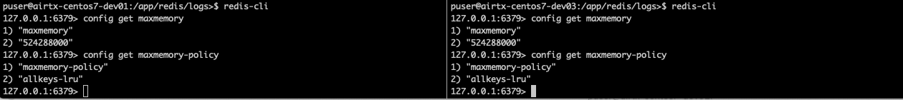
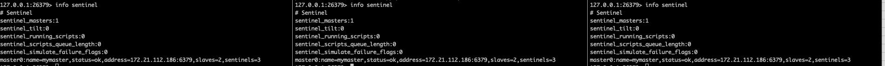

# 목적

- redis master/slave/slave 구성 및 sentinel 을 이용한 무중단 서비스를 구성한다.

## redis replication 설정

- dev1/dev2/dev3 서버의 slave/master/slave 구성을 할 경우

| dev1 | dev2 | dev3 |
|---|:---:|---:|
| 172.21.114.123 | 172.21.112.186 | 172.21.115.114 |

- slave 서버인 dev1/dev3 서버 etc/redis_6379.conf 에 아래를 추가한다.

~~~
dev1 >$ vi etc/redis_6379.conf
replicaof 172.21.112.186 6379

dev3 >$ vi etc/redis_6379.conf
replicaof 172.21.112.186 6379
~~~

- dev2 서버는 이미 master 이므로 재시작 하지 않아도 된다.

## sentinel 설정

- master 를 바라보도록 모니터 설정이 되어 있어야 한다.

~~~
dev1>$ vi etc/redis_6379.conf
sentinel monitor mymaster 172.21.112.186 6379 2
dev2>$ vi etc/redis_6379.conf
sentinel monitor mymaster 172.21.112.186 6379 1
dev3>$ vi etc/redis_6379.conf
sentinel monitor mymaster 172.21.112.186 6379 2
~~~

- down 인지를 좀더 빨리 할수 있도록 다음과 같이 3초로 설정을 추가해 주는 것이 좋다(Default 30초)

~~~
$ vi ../etc/sentinel_26379.conf
sentinel down-after-milliseconds <master-name> <milliseconds>
sentinel down-after-milliseconds mymaster 3000
~~~

## fail over 테스트(무중단 동작 확인)

- 각 서버에서 sentinel 상태 확인

~~~
$ redis-cli -p 26379
127.0.0.1:26379> info sentinel
~~~

- RedistestApplicat.java 실행

- 모든 인스턴스 maxmemory, maxmemory-policy 설정 상태 확인
  

- 모든 인스턴스 설정에 maxmemory, maxmemory-policy 설정 추가

~~~
$ vi ../etc/sentinel_26379.conf
maxmemory 500mb
maxmemory-policy allkeys-lru
~~~

- slave 서버인 dev1, dev3 재시작

~~~
dev1>$ ../bin/startRedis_6379.sh restart
dev3>$ ../bin/startRedis_6379.sh restart
~~~

- slave 서버인 dev1, dev3 재시작후 maxmemory 설정 반영 된 것 확인
  

- dev2 번 master failover 처리하여 다른 slave 가 master 로 승격되도록 처리, 반드시 <strong><u>dev2 인스턴스 sentinel</u></strong> 에서 실행해야 함.

~~~
127.0.0.1:26379> sentinel failover mymaster
OK
~~~

- dev3 인스턴스가 master 로 승격됨
  

- 무중단 확인 및 redis client 프로그램 로그, 다음과 같이 fail over 발생시 서비스가 중된되지 않고 정상 동작 하는 것을 확인 할 수 있다.
- 이 때 redis client application 로그
  

- failover 된 master 서버였었떤 dev2 재시작

~~~
dev2>$ ../bin/startRedis_6379.sh restart
~~~

- slave 서버인 dev1, dev3 재시작후 maxmemory 설정 반영 된 것 확인
  

- 다시 dev3 인스턴스 failover, 반드시 <strong><u>dev3 인스턴스 sentinel</u></strong> 에서 실행해야 함.

~~~
127.0.0.1:26379> sentinel failover mymaster
OK
~~~

- 이 때 redis client application 로그
  

- dev2 인스턴스가 다시 master 가 됨
  